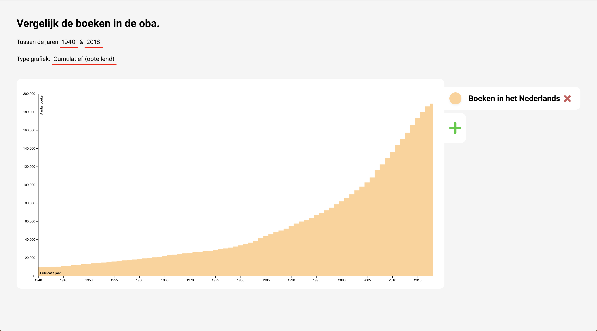

# Frontend Data
Globalisering van de boeken. (Gemeten met de boeken uit de OBA). Zijn er relatief meer internationale boeken bijgekomen vanaf circa 1980?

[Link to graph](https://gijslaarman.github.io/frontend-data/) sorry for the long wait..


<br>

# Inhoudsopgave
1. [Introductie](#introductie)
2. [Bevindingen](#bevindingen)
3. [Het Proces](#proces)

---
<a id="introductie"></a>

# Introductie
#### Hypothese: 

##### "De laatse jaren zijn we door globalisering meer buitenlandse boeken gaan lezen: zowel vertaald als in de originele taal."

- Zijn de buitenlandse boeken harder gestegen dan Nederlandse boeken?
- Wat is de meest voorkomende taal?

#### Wat heb ik allemaal nodig?

Om de data representatief te laten zijn, heb ik  boeken **442.525** boeken uit de OBA API opgehaald. *Fun! \*kuch*. Maar goed uiteindelijk moet ik het nog steeds doen met de boeken die in de OBA gevonden kunnen worden. Ik heb ze gesorteerd op publicatie jaar.
<br>

---
<a id="bevindingen"></a>

# Bevindingen
Ik heb alle 400k+ boeken gesorteerd op publicatie jaar. Daarvan kan je in de grafiek selecteren welke taal je wilt zien en wilt vergelijken. 

Interssante bevindingen: 
- Nederlandse boeken zijn flink gestegen in de afgelopen jaren.
- Het totale aanbod van vertaalde boeken is procentueel gezien bijna even hoog als het aantal originele Nederlandse boeken.
<br>

---
<a id="proces"></a>

# Het Proces
Dit project was een hele uitdaging. Ik wilde persee alle boeken ophalen, om mijzelf uit te dagen en om mijn dataset compleet te maken (meer boeken = representatiever).

#### De data ophalen
Het was erg lastig om alle 425.525 op te halen, het was niet het lastigste overigens. Ik heb er nog een week over gedaan tijdens front-end data om alle 425.525 boeken op te halen.

Uit eindelijk heb ik een [npm package](https://www.npmjs.com/package/@gijslaarman/oba-scraper) geschreven om makkelijk te delen met mijn studiegenoten. Met de OBA-scraper kan je de juiste boeken ophalen zonder moeite.

Met die data outputten ik een JSON die er ongeveer zo uitzag per boek:
```json
[
    {"pubYear": "2012", "language": "dut", "originalLanguage": "eng"},
    // ...etc
]
```

#### De data transformeren voor d3
Wat ik wilde bereiken is om in D3 per publicatie jaar het aantal boeken van die taal te laten zien.
Ik had in gedachte dat de JSON zo eruit zou moeten zien:
```json
[
    {"year": "2012", "dut": 23, "eng": 15, "engdut": 9},
    //..volgend jaar
]
```
Alle dubbele "taalcodes" zoals ik ze noemden stonden voor vertalingen, `engdut` is vertaald van het Engels naar het Nederlands. Zo kon ik later ook de vertalingen ophalen.

Ik had veel moeite met het filteren, ik moest vooral nadenken hoe ik dit dynamisch kon doen zodat ik geen taalcodes hard erin moest coden. Dit leverde heel veel gekke dingen op in mijn filter zoals: `lang[langCode] = lang[langCode] + 1`.

Dat per jaar filteren lukte wel, met een for loopje waar je de index laat beginnen bij jouw gewenste begin jaar en eindigt bij het gewenste eindjaar: 
```javascript
for (let i = 1900; i <= 2018; i++)
```
Dan loopte ik dus per boek per jaar door de data (dus ja heel veel loopen :/). Dan vergelijkten ik of het publicatiejaar van het boek gelijk is aan `i` en dan pushten ik het boek in een array van dat jaar. Na elke jaar loop returnden ik een object:
```javascript
{
    year: i,
    langCode: amount
    // Voor elke langCode die ik ophaalden werd hierin gepusht, 
    // als de langcode al bestond dan werd er eentje bij opgeteld.
}
``` 
in de uiteindelijke array.

Dat lukte nog allemaal. Maar om mijn data cumulatief te laten zien moest ik ergens de data opslaan van het voorgaande jaar en dan die language codes toevoegen, zodat het optelden. 

Maar het opslaan van de vorige aantallen bleek nogal lastig i.v.m. closure. Uiteindelijk heb ik het opgelost door iedere keer alle keys en values op te halen en het in een array te stoppen per jaar, zo kon ik wel de aantallen van het vorige jaar ophalen.
Maar goed hier was ik wel 3 volle dagen mee bezig..

#### D3

Next step: een visualisatie maken. D3 was voor mij nog een flink leerproces en ook hier had ik natuurlijk weer moeite mee. Maar opeens viel het kwartje. (Ik was met een ander project bezig waar ik elementen maakten d.m.v. een klik, daar gebruikten ik ook .appendChild etc dat native in javascript zit). Toen begreep ik meer hoe D3 de elementen maakt. 

Het moeilijkste van D3 is de data in een goed format krijgen, de rest is zo gepiept.

#### Het interactief maken

Hier ging de kwaliteit van mijn code drastisch achteruit. Ik ben er niet trots meer op maar het werkt. Tenminste hoe ver het af is, ik had weinig tijd om goed te refactoren en heb de interactie ook niet af kunnen maken zoals ik graag had gewild.

#### Mijn 50%
Zo noem ik de interactie momenteel. Het is 50% af. Dit is wat ik allemaal in gedachte had:

- [x] Data laten zien
- [x] Data cumulatief laten zien
- [x] Jaren kunnen selecteren
- [x] Talen dynamisch kunnen toevoegen
- [x] Kleur kiezen voor de taal
- [x] De aantallen laten zien on hover
- [ ] De volgorde van talen aanpassen
- [ ] Percentueel de data laten zien
- [ ] Tabs kunnen aanpassen
- [ ] Styling mooier maken
- [ ] Laad scherm

Waarschijnlijk ga ik nog wat van deze dingen toepassen wanneer ik de tijd ervoor heb. Voor nu zal ik het hier mee moeten doen.

# Conclusie
Ik heb onwijs veel geleerd deze twee weken. Vond het zeker interessant en ook omdat ik het erg leuk vond om uit te zoeken hoe ik onwijs veel data kan ophalen. 
Ik heb veel mensen geholpen wat voor mijzelf ook mooie leer momenten zijn. Ik denk wel dat ik af en toe mijzelf in de vingers heb gesneden door mensen te helpen i.p.v. aan mijn eigen project te werken.


